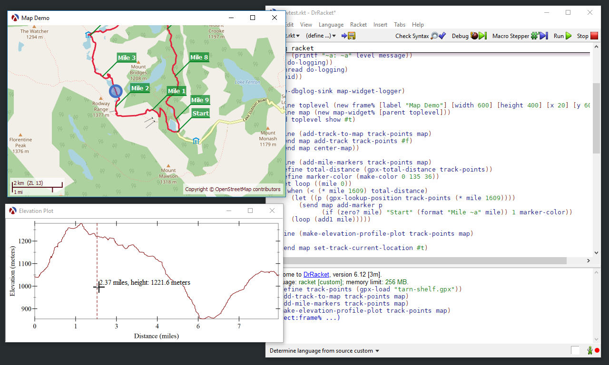

# map-widget

This is a map GUI widget for Racket.  It can display a map based on [Open
Street Map](https://www.openstreetmap.org) tiles and it can overlay GPS tracks
and locations on top of the map.  The map can be panned and zoomed with the
mouse.

For an overview, see https://alex-hhh.github.io/2018/06/a-racket-gui-widget-to-display-maps-based-on-openstreetmap-tiles.html

